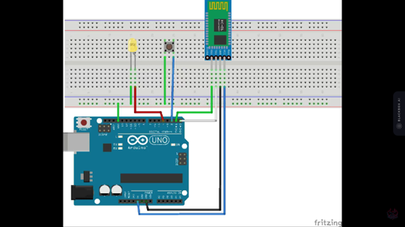

# Documentación del Proyecto de Telégrafo con Arduino y Bluetooth

## Introducción

Este proyecto tiene como objetivo la creación de un telégrafo controlado por un Arduino Mega, que se comunica mediante Bluetooth con una aplicación desarrollada en App Inventor. Los elementos clave incluyen un módulo Bluetooth HC06, una protoboard, un buzzer, un LED y un pulsador, todos conectados mediante jumpers macho-macho.

## Materiales Utilizados

- Arduino Mega
- Jumpers macho-macho
- Módulo Bluetooth HC06
- Protoboard
- Buzzer
- LED
- Pulsador

## Descripción del Proyecto

### Diagrama de Conexiones

### Funcionamiento

1. **Conexión Bluetooth:**
   - El Arduino Mega se conecta al módulo Bluetooth HC06 a través de la comunicación serial para permitir la interacción con una aplicación externa.

2. **Interfaz de la Aplicación:**
   - Se ha desarrollado una aplicación utilizando App Inventor que se comunica con el Arduino Mega a través de Bluetooth. La aplicación permite enviar mensajes al Arduino para ser transmitidos por el telégrafo.

3. **Transmisión de Mensajes:**
   - Al recibir un mensaje desde la aplicación, el Arduino interpreta el contenido y genera señales acústicas y visuales a través del buzzer y el LED respectivamente.

4. **Acción del Pulsador:**
   - Al presionar el pulsador, se activa la transmisión del mensaje almacenado en el Arduino, el cual es enviado a la aplicación a través del módulo Bluetooth.

5. **Comunicación mediante Lenguaje de Bloques:**
   - La aplicación permite al usuario pulsar letras en un determinado lenguaje con un abecedario, el cual se convierte en texto mediante concatenación de bloques de pulsaciones. Esto posibilita una comunicación más interactiva.

## Procedimiento de Montaje

1. **Conexión de Componentes:**
   - Conectar el módulo Bluetooth HC06 al Arduino Mega utilizando jumpers macho-macho.
   - Conectar el buzzer y el LED a la protoboard y conectar la protoboard al Arduino Mega utilizando jumpers macho-macho.
   - Conectar el pulsador a la protoboard y conectar la protoboard al Arduino Mega utilizando jumpers macho-macho.

2. **Configuración del Software:**
   - Cargar el código en el Arduino Mega utilizando el entorno de desarrollo Arduino.
   - Instalar y configurar la aplicación en el dispositivo móvil a través de App Inventor.

## Conclusiones

Este proyecto demuestra cómo se puede utilizar Arduino y Bluetooth para crear un sistema de telégrafo interactivo que permite la transmisión de mensajes a través de señales acústicas y visuales. Además, la adición de la funcionalidad de traducción de pulsaciones a texto facilita una comunicación más eficiente y enriquecedora.

---
 

  

  <i>DESCARGAR APP</i>

